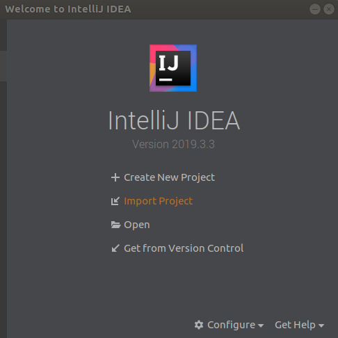
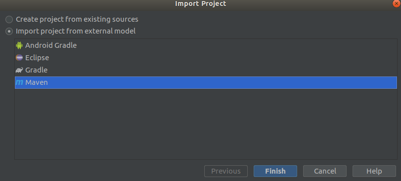
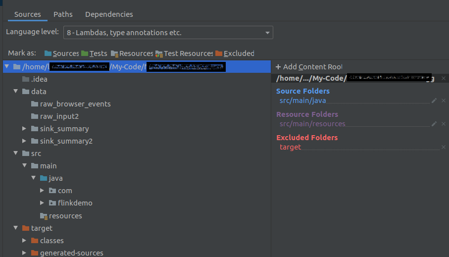
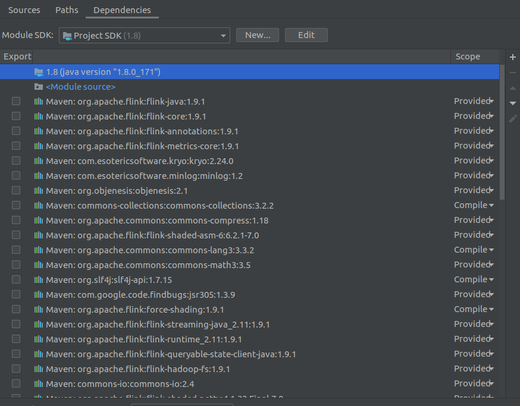
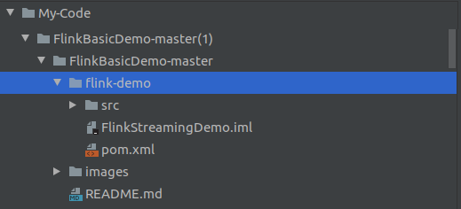
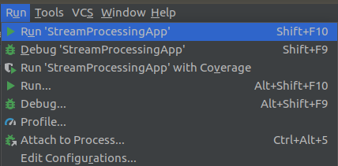
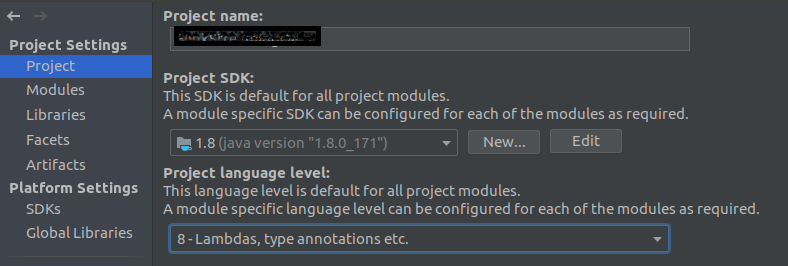
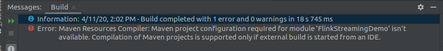
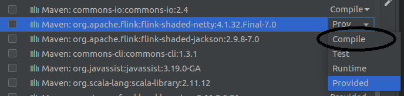
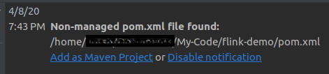

# Как использовать этот репозиторий?

## Настройка проекта
1. Загрузите этот репозиторий или клонируйте его локально.
2. Откройте IntelliJ.
3. Нажмите на Импорт проекта, выберите flink-demo, который находится в корневой папке, которую вы загрузили с GitHub.
   
   
4. Выберите Maven в качестве внешнего модуля.
   

## Структура проекта и папки

После открытия проекта с помощью IntelliJ выберите Настройки проекта -> Модули. В левой части окна вы должны увидеть следующую структуру и конфигурацию:

1. Исходные тексты проекта; иерархия описывает его структуру.
   

2. Пути к проекту (the targets to the .class files)
   

3. Зависимости проекта (JVM и связанные с ней пакеты)
   
   

## Скомпилируйте и запустите

После создания проекта вы можете запустить основное приложение StreamProcessingApp:

Приложение отображает простое меню, позволяющее пользователю выбрать, какой тип потоковой обработки запускать, например: базовая обработка, разделение и слияние потоков, обработка потоков на основе окна, основанного на времени сеанса.
_Если вы столкнетесь с проблемами компиляции или ошибками во время выполнения, пожалуйста, обратитесь к разделу "Устранение неполадок"._

### Файлы проекта и функциональность

- Основное приложение запускается из [класса StreamProcessingApp][6].
- Каждый класс потоковой обработки реализует [интерфейс ProcessStream][5].
- Примеры для различных [классов потоковых процессов][3]:
  - BasicStreamOperations: обработка событий и сохранение результатов в приемнике (папке).
  - SplitStreamOperation: разделение потока на несколько потоков с одновременным преобразованием типа данных. Затем вызывается метод для объединения двух потоков и создания потока нового типа.
  - Операции с окном, основанные на времени: группируйте поток и обрабатывайте его в соответствии с окном сеанса, основанным на времени.
- Классы вспомогательных объектов и объектов данных расположены в [папке common][4].
## Устранение неполадок

В случае возникновения проблем при компиляции или запуске проекта проверьте следующее:

### Проверьте правильность определений проекта

1. Убедитесь, что с проектом связана правильная JVM.

2. Убедитесь, что пакеты Java и Flex включены в компиляцию, и измените область действия пакетов на "Compile"; в противном случае вы можете столкнуться с ошибками компиляции, например:

Чтобы устранить проблему, измените область действия пакетов на компиляцию через графический интерфейс пользователя (вы также можете сделать это, изменив файл FlinkStreamingDemo.iml):

3. Если файл pom.xml не найден, вы получите предупреждение, приведенное ниже; затем установите проект как проект Maven.

4. Другое предупреждение может быть связано с импортом зависимостей Maven. Настройка автоматического импорта может помочь.

